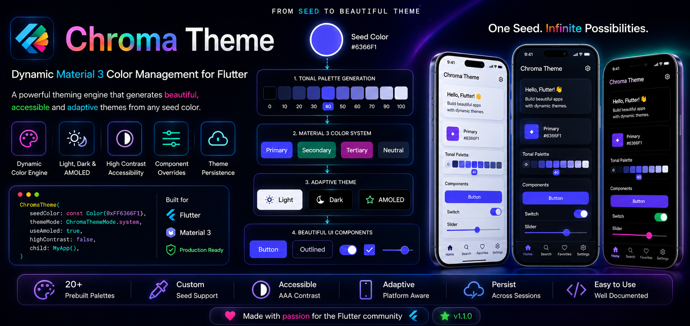

# Chroma Theme 🎨

[](https://pub.dev/packages/chroma_theme)
[](https://opensource.org/licenses/MIT)
[](https://flutter.dev)

A premium, dynamic, and adaptive Material 3 theme engine for Flutter. **Chroma Theme** simplifies complex theme management, providing system-aware modes, custom tonal palettes, and beautiful animated transitions with zero boilerplate.



---

## ✨ Key Features

- 🌓 **Intelligent Mode Switching** – Support for `Light`, `Dark`, `System`, `High Contrast`, and a dedicated **AMOLED** mode.
- 🎨 **Dynamic Seed Generation** – Generate entire ColorSchemes from a single primary color or a complete set of seeds.
- 🎭 **Predefined Premium Palettes** – 20+ professionally curated palettes (e.g., `Neon Forest`, `Midnight Mint`, `Berry Blush`).
- 🌊 **Smooth Transitions** – Built-in `AnimatedTheme` support for delightful UI state changes.
- 🛠️ **Tonal Palette Access** – Direct access to Material 3 tones (0-100) for every color in your scheme.
- 🧩 **Component Overrides** – Easily customize specific Material widgets globally without messy `ThemeData` blocks.
- 🚀 **Zero Boilerplate** – Intuitive `BuildContext` extensions for ultra-fast development.

---

## 📦 Installation

Add `chroma_theme` to your `pubspec.yaml`:

```yaml
dependencies:
  chroma_theme: ^1.1.0
```

Then run:
```bash
flutter pub get
```

---

## 🚀 Quick Start

Wrap your `MaterialApp` (or your root widget) with `ChromaTheme`:

```dart
import 'package:chroma_theme/chroma_theme.dart';
import 'package:flutter/material.dart';

void main() {
  runApp(
    ChromaTheme(
      initialMode: ChromaThemeMode.system,
      initialPalette: ChromaPalette.blue,
      child: const MyApp(),
    ),
  );
}

class MyApp extends StatelessWidget {
  @override
  Widget build(BuildContext context) {
    // ChromaTheme automatically handles Theme/DarkTheme for your MaterialApp
    return MaterialApp(
      title: 'Chroma Demo',
      // If child is MaterialApp, ChromaTheme injects theme/darkTheme/themeMode
      home: const HomeScreen(),
    );
  }
}
```

---

## 🛠️ Advanced Usage

### Accessing the Controller
Toggle themes or change palettes from anywhere using the extension:

```dart
final chroma = context.chroma;

// Switch to AMOLED mode
chroma.setTheme(ChromaThemeMode.amoled);

// Use a premium palette
chroma.setPalette(ChromaPalette.neonForest);
```

### Custom Dynamic Seeds
Want total control? Provide your own seed colors:

```dart
chroma.setSeeds(
  const ChromaSeeds(
    primary: Color(0xFF00A19B),
    secondary: Color(0xFFE4DDD3),
    neutralLight: Color(0xFFF5F1EA),
  ),
);
```

### BuildContext Power Tools
Access colors and text styles instantly:

```dart
// Current ColorScheme
final colors = context.chromaColors; 

// Current TextTheme
final text = context.chromaText;

// Specific Tonal Palettes (M3)
final primaryTone50 = context.chromaTones.primary[50];
```

---

## 🎨 Predefined Palettes

Chroma Theme comes packed with beautiful palettes out of the box:

| Palette | Aesthetic |
| :--- | :--- |
| `oceanSignal` | Deep blues with safety orange accents |
| `neonForest` | Dark greens with vibrant highlights |
| `mintLatte` | Soft, creamy greens and browns |
| `blackMetal` | Aggressive grays and deep blacks |
| `softMauve` | Gentle purples and muted tones |
| ... and 15+ more! | [View all in API Reference](API.md) |

---

## 🏛️ Component Overrides

Clean up your code by defining component styles once at the root:

```dart
ChromaTheme(
  overrides: ChromaOverrides(
    appBarTheme: const AppBarTheme(centerTitle: true, elevation: 0),
    cardTheme: CardThemeData(
      shape: RoundedRectangleBorder(borderRadius: BorderRadius.circular(16)),
    ),
  ),
  child: const MyApp(),
)
```

---

## 💾 Persistence

Implement the `ThemePersistence` interface to save user preferences (e.g., via `shared_preferences` or `hive`).

```dart
class MyThemeStorage implements ThemePersistence {
  @override
  Future<void> save(ChromaThemeSettings settings) async { /* ... */ }
  
  @override
  Future<ChromaThemeSettings?> load() async { /* ... */ }
}
```

---

## 📖 Documentation

For detailed API breakdowns and advanced guides:
- 📑 [API Reference](API.md)
- 💡 [Usage Guide](USAGE_GUIDE.md)
- 🚀 [Example App](example/)

---

## 🤝 Contributing

Contributions are welcome! Please feel free to submit a Pull Request or open an issue for any bugs or feature requests.

## 📄 License

This project is licensed under the MIT License - see the [LICENSE](LICENSE) file for details.

---

## 👨‍💻 Author

**Satyam Gawali**

[](https://github.com/Satyam-Gawali)
[](https://www.linkedin.com/in/satyam-gawali-b4623b268/)
